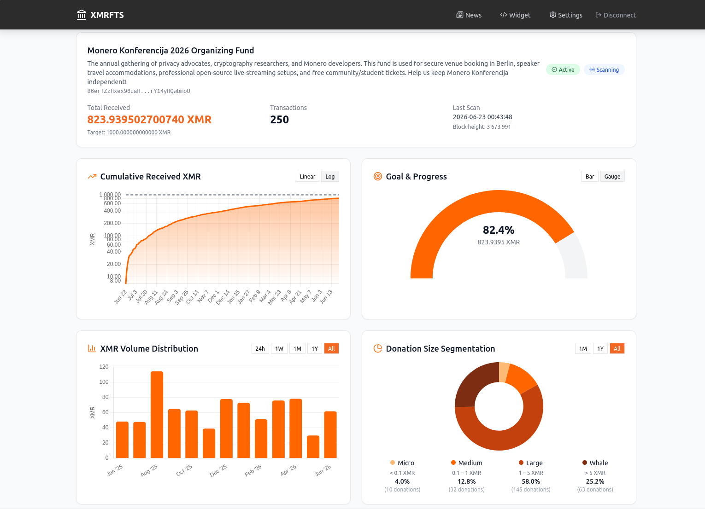

# XMR Fund Transparency Suite

<p align="center">
  
  
  
  
  
  
</p>

<p align="center">
  
  
  
  
  
  
  
</p>

> Self-hosted, view-only transparency tool for Monero crowdfunding, CCS milestones, and donation tracking with real-time analytics.

---

## 🌐 Live Production Website

The official landing page and live tracking demonstration of this project is running at **[xmrfts.com](https://xmrfts.com)**.

## 🧪 Live Demo Application

A separate, isolated demo instance is available at **[demo.xmrfts.com](https://demo.xmrfts.com)** so you can try the full admin dashboard (wallet management, fund creation, charts, exports, and widget settings).

To log in to the demo dashboard, use the API key:

```
OUR_SECRET_KEY_PASSWORD_FOR_DEMO
```

> **Note:** This is a shared demo key intended for public trial access only. The demo instance is reset periodically, so any funds, transactions, or settings you create may be removed.

---

## ⚡ The Challenge: Crowdfunding in Pure Privacy

Monero is the gold standard for financial privacy. But if you are a developer, streamer, NGO, or the author of a CCS proposal, this absolute privacy becomes your biggest bottleneck:
* **The Trust Gap:** How do you prove to your community that you've actually received 45 XMR out of a 100 XMR goal without making them wait for manual spreadsheet updates?
* **The Security Nightmare:** Sharing wallet screenshots or raw logs is unprofessional, but exposing your **private spend key** just to prove your balance is suicidal — one mistake, and all your funds are gone.
* **The Routine Drain:** Manually tracking incoming donations, verifying hashes for users, and updating progress bars on your website takes hours that should be spent writing code or creating content.

**If your community can't see the progress, momentum dies, and donations dry up.**

---

## 🚀 The Solution: XMR Fund Transparency Suite

**XMR FTS** turns voluntary transparency into a powerful tool to build trust and accelerate your funding goals. By utilizing Monero's native mathematical architecture, it scans the blockchain using **only your private view key**.

Your coins remain 100% secure in cold storage, while your donors get a beautiful, interactive, real-time proof of your fund's life and milestones.

### 🎯 Why use XMR FTS for your next campaign?

* **Eliminate "Donation Hesitation":** When donors see a beautiful, real-time cumulative chart moving toward a milestone, the "FOMO effect" kicks in. They want to be the ones who push the progress bar to 100%.
* **Zero-Maintenance Transparency:** Drop our sleek, responsive widget into your existing website or blog. Once it's there, you never have to manually report a donation again. The suite automatically detects blocks, updates progress, and keeps your community in the loop.
* **Keep Personal Funds Personal:** Built-in **Sub-Address Isolation** means you can generate a specific sub-address (starting with `8...`) for a target campaign (e.g., "Buy me a coffee"). XMR FTS will strictly track that sub-address, completely ignoring your main wallet balance and personal transactions.
* **Professional Audit-Ready Reports:** Generate executive cryptographic summaries or download structured financial sheets (PDF, XLSX, CSV, XML, JSON) with a single click to back up your milestone claims on Reddit, Gitlab, or the Monero CCS platform.
* **Engage Donors Instantly:** Use the built-in microblog to publish code updates or status reports directly inside the public widget. When people come to donate, they don't just see a cold QR code — they see active development and a live 24-hour fresh news counter.

> **Multi-Wallet, Multi-Fund Architecture:** A single XMR FTS instance can manage **multiple view-only wallets**, each containing **multiple funds** with their own deposit sub-addresses. Switch between wallets and funds in the dashboard, give each fund its own branded widget, and let the background scanner handle them all.

---

## Key Features

### 🔒 View-Key Only Security

Your private view key is **never stored in plaintext**. It is encrypted at rest using **AES-256 via Fernet** (`cryptography` library) with a master secret from the `VIEW_KEY_MASTER_SECRET` environment variable. The scanner decrypts it in-memory only during RPC calls, and the key is **never logged**.

### 💼 Multi-Wallet Support

Connect **multiple Monero view-only wallets** to a single XMR FTS instance. Each wallet is independently managed — create, pause, or remove wallets at any time. The background scanner cycles through all active wallets, and the dashboard provides a wallet selector to switch between them.

### 🎯 Sub-Address Isolation (`deposit_address`)

Each fund exposes an optional `deposit_address` field. When set (for example, a subaddress starting with `8...`), the scanner **filters all incoming transfers** and counts only transactions arriving at that specific address. Personal transfers to the primary address or other subaddresses are silently ignored.

Changing the `deposit_address` automatically resets scan history and triggers a full rescan.

### 🎨 Per-Fund Widget Styling

Each fund has its own `widget_background_color` and `widget_text_color`, configurable via the fund settings page. Drop a `<script>` tag into any website to display live donation progress, a QR code, and a collapsible news feed — all branded to match your campaign.

### 📊 Advanced Analytics (4 Charts)

| Chart | Description |
|-------|-------------|
| **Cumulative Received XMR** | Area chart showing total donations over time with Monero-orange gradient fill. |
| **Goal & Progress Tracker** | Interactive toggle between a horizontal progress bar with milestones and a radial gauge for visual fundraising targets. |
| **XMR Volume Distribution** | Bar chart of donation activity across time periods with adjustable range filters. |
| **Donation Size Segmentation** | Donut chart classifying donors into tiers: **Micro** (< 0.1 XMR), **Medium** (0.1–1.0 XMR), **Large** (1.0–5.0 XMR), **Whale** (> 5.0 XMR). |

### 🔍 Data Filtering & Multi-Sorting

The transaction table supports **multi-column sorting** (for example, `timestamp:desc,amount_xmr:asc`) and rich filtering by:

- **Date range** (`start_date`, `end_date`)
- **Amount tiers** (`tiers=micro,medium,large,whale`)

Filter logic lives in a single shared module (`backend/app/filters.py`) and is reused by the paginated list, exports, and public widget.

### 📄 Multi-Format Financial Reports

Download professional reports in **PDF, XLSX, CSV, XML, and JSON** from a unified endpoint:

- **PDF** — Rendered via Jinja2 → HTML → WeasyPrint with a detailed header (actual balance, target balance, filter metadata, last scanned height) and footer calculations.
- **XLSX** — Generated with `openpyxl`.
- **CSV, XML, JSON** — Standard structured formats for accounting integrations.

All exports respect the same filters and sorting as the live transaction table.

### 📢 News Micro-Blog Inside Public Widget

- Manage short fund announcements directly from the admin dashboard.
- Posts are tied to a fund via foreign key with **CASCADE** delete.
- The public embed widget includes a collapsible News section with a **freshness badge** (`+N`) when posts were published within the last 24 hours.
- The widget also renders a **QR code** pointing to the donation address.

### ⚡ Real-Time Updates via SSE

The scanner publishes events to Redis Pub/Sub. The frontend listens to `/api/v1/wallets/{id}/events` over **Server-Sent Events** (SSE) with a 30-second heartbeat, updating the dashboard instantly as new donations arrive — no polling required.

---

## Screenshots

### Public Embed Widget

Drop a single `<script>` tag into any website to display live donation progress, a QR code for mobile payments, and a collapsible news feed with freshness indicators.


### Fund Management Dashboard

The admin dashboard provides real-time analytics, transaction filtering, multi-format exports, and full control over fund settings and widget appearance.



### All Screenshots

| File | Description |
|------|-------------|
| [Widget_1.png](assets/Widget_1.png) | Public embed widget (blue) |
| [Widget_2.png](assets/Widget_2.png) | Public embed widget (alternative) |
| [Dashboard.png](assets/Dashboard.png) | Fund admin dashboard |
| [Dashboard_Preview.png](assets/Dashboard_Preview.png) | Dashboard preview |
| [Blog_Posts.png](assets/Blog_Posts.png) | News micro-blog management |
| [Embed_Widget_Style_Settings.png](assets/Embed_Widget_Style_Settings.png) | Widget style settings |
| [System_Settings.png](assets/System_Settings.png) | System settings |

---

## Project Architecture

XMR FTS is composed of six services — FastAPI backend, Vue 3 frontend, PostgreSQL, Redis, `monero-wallet-rpc`, and a background scanner worker — orchestrated by Docker Compose. One wallet can hold multiple funds, each with its own deposit sub-address.

➡️ **Full details:** [docs/architecture.md](docs/architecture.md) — service roles, data model, and directory structure.

---

## Quick Start & Deployment

Get a production instance running in four steps — clone, run `setup.sh`, verify `.env`, and open the dashboard. A hot-reload `--dev` mode is also available.

➡️ **Full guide:** [docs/quick-start.md](docs/quick-start.md)

---

## Generating Test Data

Seed the database with demo transactions to see charts and tables in action before real donations arrive. Run `./scripts/test-data.sh --count=150` (or `--multi` for a multi-wallet dataset).

➡️ **Full guide:** [docs/test-data.md](docs/test-data.md)

---

## Updates & Rollbacks

The `update.sh` script handles zero-downtime updates with automatic PostgreSQL backups (`backups/*.sql.gz`, last 5 retained), GitHub release tag checkout, container rebuilds, and rollback via `.deploy-version`.

➡️ **Full guide:** [docs/updates.md](docs/updates.md)

---

## Production Reverse Proxy Example

A minimal Nginx `server` block that proxies traffic to the frontend container with WebSocket/SSE support, plus a recommendation to terminate TLS via Let's Encrypt. Production-grade configs live in the docs repository.

➡️ **Full example:** [docs/reverse-proxy.md](docs/reverse-proxy.md)

---

## Multi-Instance Deployment

Run multiple isolated instances (production, demo, staging, …) on the same host without port or container-name collisions. Each instance gets its own `.env`, Docker Compose project name, host ports, and data volumes via the `--instance=NAME` flag.

➡️ **Full guide:** [docs/multi-instance.md](docs/multi-instance.md)

---

## API Reference

The backend exposes an admin REST API (protected by the `X-API-Key` header) covering wallets, funds, transactions, exports/reports, posts, and settings, plus a set of public widget endpoints with no auth required.

➡️ **Full reference:** [docs/api-reference.md](docs/api-reference.md)

---

## Environment Variables

All configuration is injected via the `.env` file — secrets (`DB_PASSWORD`, `API_KEY`, `VIEW_KEY_MASTER_SECRET`), Monero RPC/daemon endpoints, scan/log settings, CORS, Sentry, and per-instance Docker ports. Generate `VIEW_KEY_MASTER_SECRET` with `openssl rand -hex 32`.

➡️ **Full reference:** [docs/environment-variables.md](docs/environment-variables.md)

---

## ☕ Support & Donations

If **XMR Fund Transparency Suite** helped you build trust with your community or made your CCS campaign a little more transparent, consider sending some crypto-dust to support the developer. Every satoshi, gwei, and piconero keeps the code clean and the commits smooth!

| Coin | Network | Address |
|------|---------|---------|
| **Monero** | XMR | `89tK9E9LbwdCsnnZGFMJzU7yBRGaQ7hfPTeNXWCe2LW3G7kCkJWswhb2ieBkHFrBs2JfdsmumQ3nY9obQ6fxb4HzHpTjCjd` |
| **Bitcoin** | BTC | `bc1qh0t2u7d7u0pl2yzmxuq80verhlfxuj0r29lfv7` |
| **USDT** | Polygon | `0xe1aAE089F1b0A3b2649017A7E7afa720877409C8` |
| **USDC** | Polygon | `0xe1aAE089F1b0A3b2649017A7E7afa720877409C8` |
| **USDT** | TRON | `TMkxXPuxamSci19rSygy58QRjZ9vmLjqtu` |
| **Ethereum** | Arbitrum | `0xe1aAE089F1b0A3b2649017A7E7afa720877409C8` |

---

<div align="center">

**[Report Bug](https://github.com/risubrevis/xmr-fund-transparency-suite/issues) · [Request Feature](https://github.com/risubrevis/xmr-fund-transparency-suite/issues) · [Releases](https://github.com/risubrevis/xmr-fund-transparency-suite/releases)**

</div>

---

## License

MIT
